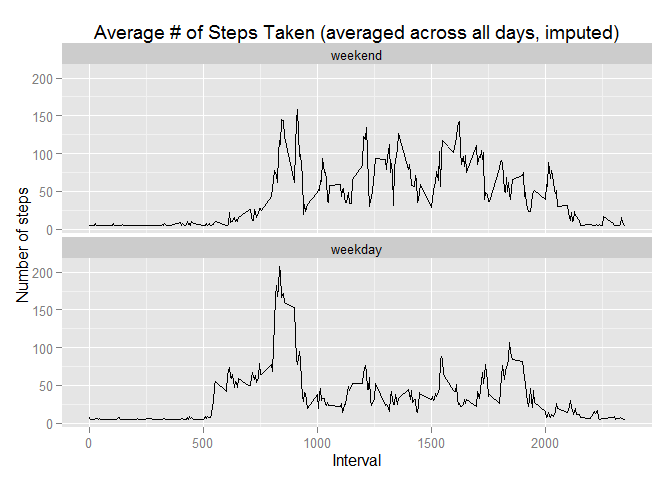

# Reproducible Research: Peer Assessment 1

Clean up memory and load needed libraries:

```r
    ## Clean up
    rm(list=(ls()))

    ## Load libraries
    library(plyr)
    library(dplyr)
```

```
## 
## Attaching package: 'dplyr'
## 
## The following objects are masked from 'package:plyr':
## 
##     arrange, count, desc, failwith, id, mutate, rename, summarise,
##     summarize
## 
## The following object is masked from 'package:stats':
## 
##     filter
## 
## The following objects are masked from 'package:base':
## 
##     intersect, setdiff, setequal, union
```

```r
    library(ggplot2)
```


## Loading and preprocessing the data

Load data and group by date:

```r
## Load data/display summary
data <- read.csv("data\\activity.csv")
summary(data)
```

```
##      steps                date          interval     
##  Min.   :  0.00   2012-10-01:  288   Min.   :   0.0  
##  1st Qu.:  0.00   2012-10-02:  288   1st Qu.: 588.8  
##  Median :  0.00   2012-10-03:  288   Median :1177.5  
##  Mean   : 37.38   2012-10-04:  288   Mean   :1177.5  
##  3rd Qu.: 12.00   2012-10-05:  288   3rd Qu.:1766.2  
##  Max.   :806.00   2012-10-06:  288   Max.   :2355.0  
##  NA's   :2304     (Other)   :15840
```


## What is mean total number of steps taken per day?

Analyze daily data ignoring NAs:

```r
## Group data by date
data.group.date <- group_by(data, date)

## Sum # of steps per day
data.sum.date <- summarize(data.group.date, steps = sum(steps))

## Display histogram
hist(data.sum.date$steps, col = "blue", xlab = "Steps per day", main = "Total Number of Steps Taken Each Day")
```

 

```r
## Report mean and median # of steps
summarize(data.sum.date, mean = mean(steps, na.rm = TRUE), median = median(steps, na.rm = TRUE))
```

```
## Source: local data frame [1 x 2]
## 
##       mean median
## 1 10766.19  10765
```


## What is the average daily activity pattern?

Analyze average daily activity pattern (ignoring NAs):

```r
## Group data by interval
data.group.interval <- group_by(data, interval)

## Average # of steps per interval
data.sum.interval <- summarize(data.group.interval, mean = mean(steps, na.rm = TRUE))

## Display time series
ggplot(data.sum.interval, aes(x = interval, y = mean)) + geom_line() + xlab("Interval") + ylab("Steps") + ggtitle("Average # of Steps Taken (averaged across all days)")
```

 

```r
## Which 5-minute interval, on average across all the days in the dataset, contains the maximum number of steps
data.sum.interval[which(data.sum.interval$mean == max(data.sum.interval$mean)), ]
```

```
## Source: local data frame [1 x 2]
## 
##   interval     mean
## 1      835 206.1698
```


## Imputing missing values

Determine impact of missing values. We then imput the missing values by using the mean of non-NA observations.

```r
## Calculate the toal number of missing values in the dataset
sum(is.na(data$steps))
```

```
## [1] 2304
```

```r
## Determine value to use for missing values (mean for non-NA)
na_fill_value <- mean(data$steps, na.rm = TRUE)

## Create a new dataset that is equal to the original dataset but with the missings data filled in
data.nona <- data
data.nona[is.na(data.nona)] <- na_fill_value

## Group data by date
data.nona.group.date <- group_by(data.nona, date)

## Sum # of steps per day
data.nona.sum.date <- summarize(data.nona.group.date, steps = sum(steps))

## Display histogram
hist(data.nona.sum.date$steps, col = "cyan", xlab = "Steps per day", main = "Total Number of Steps Taken Each Day")
```

 

```r
## Report mean and median # of steps
summarize(data.nona.sum.date, mean = mean(steps, na.rm = TRUE), median = median(steps, na.rm = TRUE))
```

```
## Source: local data frame [1 x 2]
## 
##       mean   median
## 1 10766.19 10766.19
```


## Are there differences in activity patterns between weekdays and weekends?

```r
## Create new factor var
list_weekdays <- c('Monday', 'Tuesday', 'Wednesday', 'Thursday', 'Friday')
data.nona$wd_we <- factor((weekdays(as.Date(data.nona$date)) %in% list_weekdays) + 1L, levels = 1:2, labels=c("weekend", "weekday"))

## Average # of steps per interval
data.nona.sum.interval <- ddply(data.nona, c("interval", "wd_we"), summarize, steps = mean(steps))
    
# Panel plot
ggplot(data.nona.sum.interval, aes(x = interval, y = steps, group = wd_we)) + facet_wrap( ~ wd_we) + geom_line()
```

 
