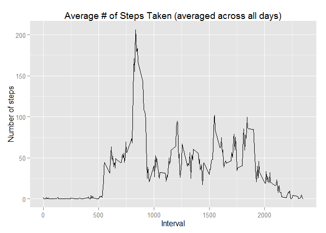

# Reproducible Research: Peer Assessment 1

Clean up memory and load needed libraries:

```r
    ## Clean up
    rm(list=(ls()))

    ## Load libraries
    library(dplyr)
```

```
## 
## Attaching package: 'dplyr'
## 
## The following object is masked from 'package:stats':
## 
##     filter
## 
## The following objects are masked from 'package:base':
## 
##     intersect, setdiff, setequal, union
```


## Loading and preprocessing the data

Load data and group by date:

```r
## Load data/display summary
data <- read.csv("data\\activity.csv")
summary(data)
```

```
##      steps                date          interval     
##  Min.   :  0.00   2012-10-01:  288   Min.   :   0.0  
##  1st Qu.:  0.00   2012-10-02:  288   1st Qu.: 588.8  
##  Median :  0.00   2012-10-03:  288   Median :1177.5  
##  Mean   : 37.38   2012-10-04:  288   Mean   :1177.5  
##  3rd Qu.: 12.00   2012-10-05:  288   3rd Qu.:1766.2  
##  Max.   :806.00   2012-10-06:  288   Max.   :2355.0  
##  NA's   :2304     (Other)   :15840
```


## What is mean total number of steps taken per day?

Analyze daily data ignoring NAs:

```r
## Group data by date
data.group <- group_by(data, date)

## Sum # of steps per day
data.sum <- summarize(data.group, steps = sum(steps))

## Display histogram
hist(data.sum$steps, col = "blue", xlab = "Steps per day", main = "Total Number of Steps Taken Each Day")
```

 

```r
## Report mean and median # of steps
summarize(data.sum, mean = mean(steps, na.rm = TRUE), median = median(steps, na.rm = TRUE))
```

```
## Source: local data frame [1 x 2]
## 
##       mean median
## 1 10766.19  10765
```


## What is the average daily activity pattern?

Analyze average daily activity pattern (ignoring NAs):

```r
## Group data by interval
data.group <- group_by(data, interval)

## Average # of steps per interval
data.sum <- summarize(data.group, mean = mean(steps, na.rm = TRUE))

## Display time series
plot(data.sum$interval, data.sum$mean, type = "l", xlab = "Interval", ylab = "Steps", main = "Average # of Steps Taken (averaged across all days)")
```

 

```r
## Report mean and median steps for each date
summarize(data.sum, max = max(data.sum$steps))
```

```
## Warning in max(data.sum$steps): no non-missing arguments to max; returning
## -Inf
```

```
## Source: local data frame [1 x 1]
## 
##    max
## 1 -Inf
```


## Imputing missing values

Determine impact of missing values

```r
## Count # of NA values
sum(is.na(data$steps))
```

```
## [1] 2304
```


## Are there differences in activity patterns between weekdays and weekends?
